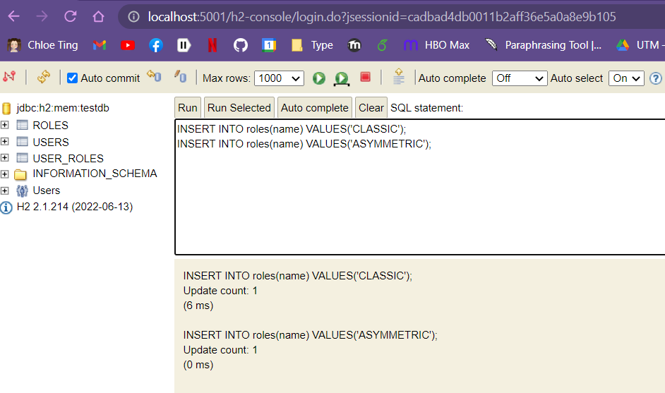
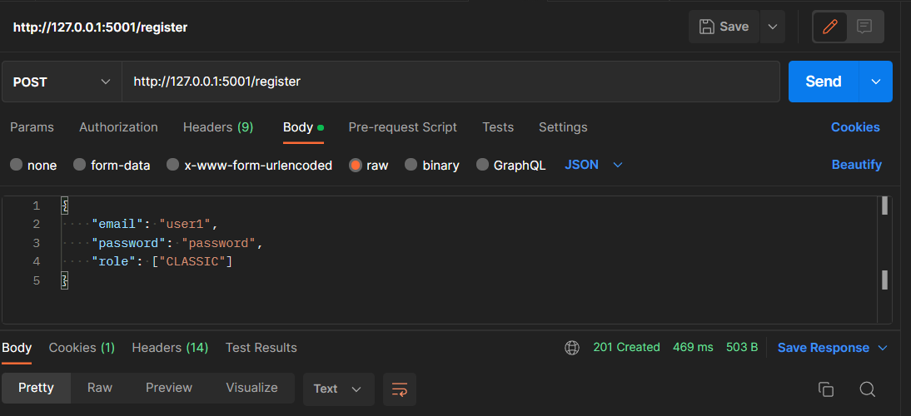
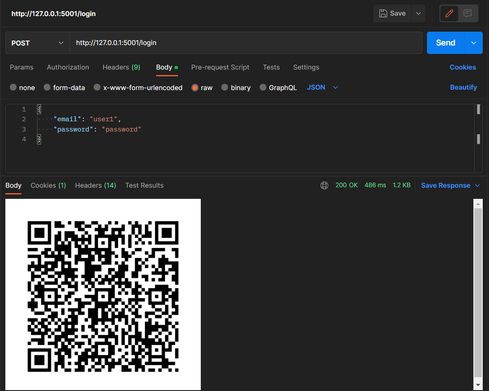
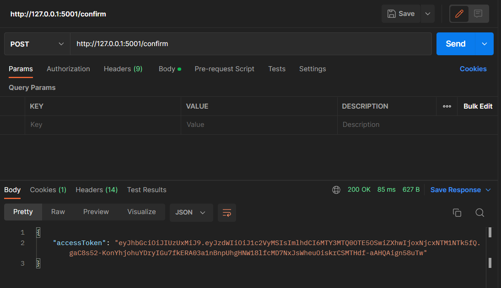
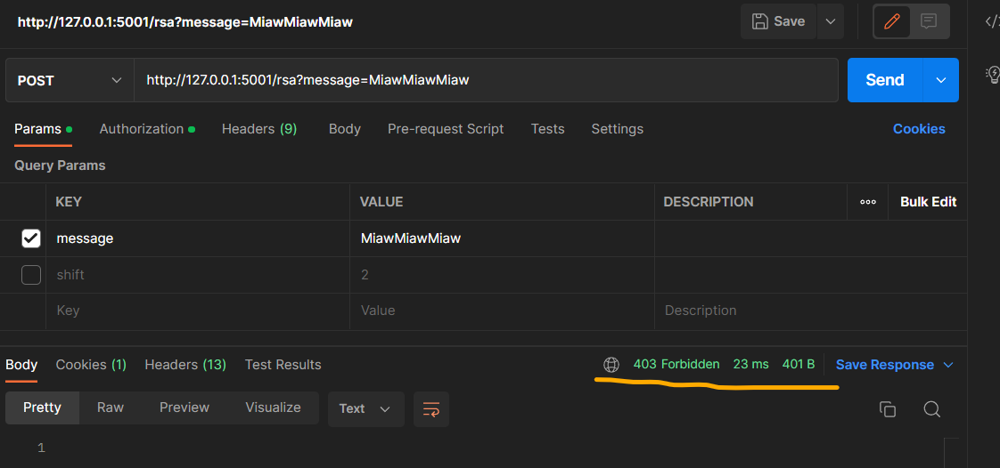
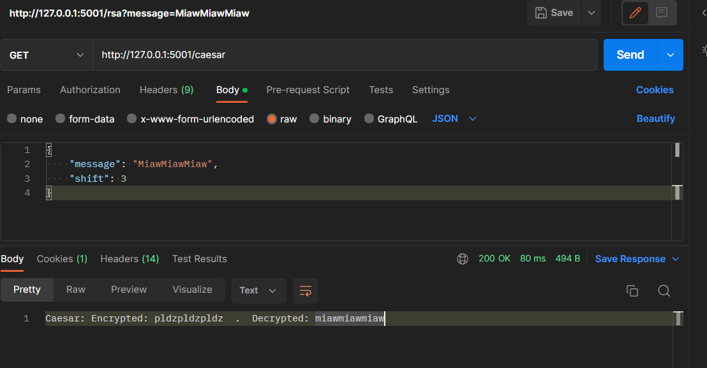

# Topic: Web Authentication & Authorisation.

## Course: Cryptography & Security

### Author: Dubina Valeria

----

# Overview

&ensp;&ensp;&ensp; Authentication & authorization are 2 of the main security goals of IT systems and should not be used interchangibly. Simply put, during authentication the system verifies the identity of a user or service, and during authorization the system checks the access rights, optionally based on a given user role.

&ensp;&ensp;&ensp; There are multiple types of authentication based on the implementation mechanism or the data provided by the user. Some usual ones would be the following:
- Based on credentials (Username/Password);
- Multi-Factor Authentication (2FA, MFA);
- Based on digital certificates;
- Based on biometrics;
- Based on tokens.

&ensp;&ensp;&ensp; Regarding authorization, the most popular mechanisms are the following:
- Role Based Access Control (RBAC): Base on the role of a user;
- Attribute Based Access Control (ABAC): Based on a characteristic/attribute of a user.


## Objectives:
1. Take what you have at the moment from previous laboratory works and put it in a web service / serveral web services.
2. Your services should have implemented basic authentication and MFA (the authentication factors of your choice).
3. Your web app needs to simulate user authorization and the way you authorise user is also a choice that needs to be done by you.
4. As services that your application could provide, you could use the classical ciphers. Basically the user would like to get access and use the classical ciphers, but they need to authenticate and be authorized.

## Theory and implementation details

For the purpose of this Laboratory work, role based authentication and two-factor authentication 
were developed with the use of JWTtokens and TOTP in Spring Framework.

To be able to configure autentification using Spring, we need to configure the Spring Security,
it's configuration is stored in `/config/WebSecurityConfig` here we can customize our Security configurations
```java
    @Bean
    public WebSecurityCustomizer webSecurityCustomizer() {
        return (web) -> web.ignoring().antMatchers("/h2-console/**");
    }

    @Bean
    public SecurityFilterChain securityFilterChain(HttpSecurity http) throws Exception {
        return http
                .cors(Customizer.withDefaults())
                .csrf(AbstractHttpConfigurer::disable)
                .authorizeHttpRequests( auth -> auth
                        .antMatchers("/login").permitAll()
                        .antMatchers("/register").permitAll()
                        .antMatchers("/confirm").permitAll()
                        .anyRequest().authenticated()
                )
                .sessionManagement(session -> session.sessionCreationPolicy(SessionCreationPolicy.STATELESS))
                .build();
    }
```
Here we disable the `csrf` give permission to access without being authorized to the following endpoints:
`/login`, `/register`, `/confirm`, and also we create an HttpSession to obtain the Security Context.

As in memory database we use `H2` so we make sure that we have access to its console by ignoring the 
request that matches `/h2-console/**`

The configuration of H2 database are stored in `application.properties` where we specify the auto load,
password, username and all others configurations.

To be able to store and verify data a UserRepository with User model and Role repository with Role
model was configured as well as tha many-to-many relationship between them:
```java
@NoArgsConstructor
@Accessors(chain = true)
@Entity
@Table(name = "users",
        uniqueConstraints = {
                @UniqueConstraint(columnNames = "email")
        })
public class User {
    @Id
    @GeneratedValue(strategy = GenerationType.IDENTITY)
    private Long id;
    private String email;
    private String password;

    @ManyToMany
    @JoinTable(name = "user_roles",
            joinColumns = @JoinColumn(name = "user_id"),
            inverseJoinColumns = @JoinColumn(name = "role_id"))
    private Set<Role> roles = new HashSet<>();

    private String secret;

    public User(String email, String password) {
        this.email = email;
        this.password = password;
    }
}
```
```java
@Entity
@Getter
@Setter
@NoArgsConstructor
@Table(name = "roles")
public class Role {
    @Id
    @GeneratedValue(strategy = GenerationType.IDENTITY)
    private Integer id;

    @Enumerated(EnumType.STRING)
    private ERole name;

    public Role(ERole name) {
        this.name = name;
    }
}
```
`Role services` and `User services` are used to find and store data into the database, the
main functions of them being `save` and `find`.

To be able to log in we have to insert the role types into the database, and next to 
make the `AuthService`. Here the logic of user registration and log in is stored.
To register we will use the `RegisterRequest` where we should provide the `email` `password` and user `roles`,
we verify if the user already exist and if everything is fine the user is saved to the database.
```java

        if (userService.existsByEmail(registerRequest.email())) {
        throw new Exception();
        }

        User user = new User( registerRequest.email(), encoder.encode(registerRequest.password()));

        Set<String> strRoles = registerRequest.role();
        Set<Role> roles = new HashSet<>();

        // logic of finding role

        user.setRoles(roles);
        userService.save(user);
```
 Now that we are able to create users in the database we specify the endpoint for it inside the `AuthController`
```java
    private final AuthService authService;

    @PostMapping("/register")
    @ResponseStatus(HttpStatus.CREATED)
    public void registerUser(@RequestBody RegisterRequest registerRequest) throws Exception {
        authService.register(registerRequest);
    }
```
After we have created users in the database, they should be able to log in. The log in process has 
two phases: first user credentials are checked using the java authenticationManager:
```java
private final SecurityContext sc = SecurityContextHolder.getContext();

Authentication authentication = this.authenticationManager.authenticate(
                new UsernamePasswordAuthenticationToken(loginRequest.email(), loginRequest.password()));
        
        sc.setAuthentication(authentication);
```
and the next phase is to generate the qr code that a user could scan and confirm identity:
```java
    public byte[] login(LoginRequest loginRequest) throws AuthException {
        //firts phase was here
                    ...
        UserDetailsImpl userDetails = (UserDetailsImpl) authentication.getPrincipal();
        String secret = mfaService.generateSecret();
        userService.save(
                userService.findByEmail(userDetails.getEmail()).setSecret(secret)
        );

        return mfaService.generateQrPng(secret, userDetails.getEmail());
    }
```
the generation of the QRcode is based on TOTP that is a java library to help generate and verify time-based one time passwords for Multi-Factor Authentication.

It generates QR codes that are recognisable by applications like Google Authenticator, and verify the one time passwords they produce.
Here is a link to the documentation: https://github.com/samdjstevens/java-totp

The logic of generation and verification of Secret codes needed for two-factor authentication
is stored in `java.com.web.webserver.services.MfaService` here we specify the needed algorithm and data as follows:
```java
    private QrData generateQrData(String secret, String email){
        return new QrData.Builder()
                .label(email)
                .secret(secret)
                .issuer("Miaw")
                .algorithm(HashingAlgorithm.SHA1)
                .build();
    }

    public byte[] generateQrPng(String secret, String email) throws AuthException {
        QrData data = generateQrData(secret, email);
        try {
            return new ZxingPngQrGenerator().generate(data);
        } catch (QrGenerationException e) {
            throw new AuthException();
        }
    }
```
In auth controller we specify the needed endpoint:
```java
    @PostMapping(
            value = "/login",
            produces = MediaType.IMAGE_PNG_VALUE
    )
    public @ResponseBody byte[] createQrAfterLogging(@RequestBody LoginRequest loginRequest) throws AuthException {
        return authService.login(loginRequest);
    }
```
To complete the login process we need to another endpoint that will verify the integrity of the `secret` and 
just then to allow the user to authenticate by giving the JWTtoken. The endpoint created is `/confirm` that
has a code in the body provided by the qr code:
```java
    @PostMapping("/confirm")
    public ResponseEntity<?> confirmMfa(@RequestBody ConfirmRequest confirm) throws Exception {
        return authService.confirm(confirm.code());
    }
```

The confirmation has the following structure, the seceret of principal user stored is checkd with the provided 
code and a JwtToken is generated, else an AuthException is thrown:
```java
    public ResponseEntity<?> confirm(String code) throws Exception {
        Object principal;
       //here is the verification of user

        String email = ((UserDetails)principal).getUsername();
        User currentUser = userService.findByEmail(email);

        if (mfaService.verify(currentUser.getSecret(), code)) {
            String jwt = jwtUtils.generateJwtToken(sc.getAuthentication());

            return ResponseEntity.ok(new JwtResponse(jwt));
        }

        throw new AuthException();
    }
```
The logic of generation the JwtTokens is stored in `jwtUtils`:
```java
    public String generateJwtToken(Authentication authentication) {

        UserDetailsImpl userPrincipal = (UserDetailsImpl) authentication.getPrincipal();

        return Jwts.builder()
                .setSubject((userPrincipal.getUsername()))
                .setIssuedAt(new Date())
                .setExpiration(new Date((new Date()).getTime() + jwtExpirationMs))
                .signWith(SignatureAlgorithm.HS512, jwtSecret)
                .compact();
    }
```

With the use of this token we can now authorize our cipher requests inside the `CipherController`:
```java
@RestController
@RequiredArgsConstructor
public class CipherController {

    @GetMapping("/caesar")
    @PreAuthorize("hasRole('CLASSIC')")
    @ResponseStatus(HttpStatus.OK)
    public String caesarCipher(@RequestParam String message, @RequestParam int shift) {
        CaesarCipher caesar = new CaesarCipher();

        String encrypted = caesar.encrypt(message, shift);
        String decrypted = caesar.decrypt(encrypted, shift);

        return "Caesar: Encrypted: " + encrypted + "  .  " +  "Decrypted: " + decrypted;
    }

    @GetMapping("/rsa")
    @PreAuthorize("hasRole('ASYMMETRIC')")
    @ResponseStatus(HttpStatus.OK)
    public String asymmetricCipher(@RequestParam String message) {
        RSA rsa = new RSA();

        BigInteger encrypted = rsa.encrypt(message);
        String decrypted = rsa.decrypt(encrypted);

        return "RSA: Encrypted: " + encrypted + "  .  " +  "Decrypted: " + decrypted;
    }
}
```

## Screenshots:

Inserting roles:


Register user:


LogIn:


ConfirmLogIn:


Access RSA endpoint:


Access Caesar endpoint:
